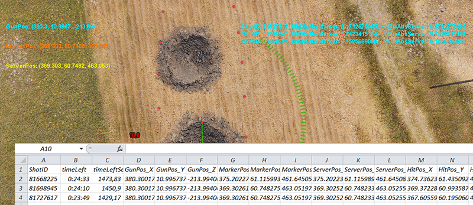

# SPGDispersion

## Описание
Мод для экспериментов, предназначен для выводы информации о попадании и разбросе снарядов у САУ при стрельбе по местности на разных дистанциях. В принципе можно использовать для любого вида техники.

## Установка
Поместить **wotmod**-файл в папку игры **"World_of_Tanks\mods\X.X.X\"**.

## Использование
Мод выводит информацию как на экран, так и в лог. Логи храняться в каталоге **"World_of_Tanks\mods\logs\SPGDispersion"**. Ниже описана выводимая модом информация.

Параметр         | Экран | Лог | Описание
-----------------|-------|-----|----------
ShotID           |   x   |  x  | ID выстрела на сервере
timeLeft         |       |  x  | Время до конца боя
timeLeftSec      |       |  x  | Тоже самое только в секундах
GunPos           |   x   |  x  | Координаты опорной точки орудия (откуда идёт выстрел) по осям X-Y-Z, м
MarkerPos        |   x   |  x  | Координаты маркера клиентского сведения, м
ServerPos        |   x   |  x  | Координаты маркера серверного сведения, м
Distance         |   x   |  x  | Расстояние между опорной точкой орудия и маркером клиентского сведения, м
DisAngle         |   x   |  x  | Тангенс угла разброса клиентского сведения, м^-1
DisAngleServer   |   x   |  x  | Тангенс угла разброса серверного сведения, м^-1
HitPos           |       |  x  | Координаты попадания снаряда в землю, м
HitDevMarker     |       |  x  | Отклонение HitPos от MarkerPos, м
HitDisAbsMarker  |   x   |  x  | Расстояние между точкой попадания и клиентским маркером, м
HitDevServer     |       |  x  | Отклонение HitPos от ServerPos, м
HitDisAbsServer  |   x   |  x  | Расстояние между точкой попадания и серверным маркером, м

В лог данные записываются в момент попадания снаряда в ландшафт, при этом указываются параметры сведения, зафиксированные в последний момент перед отправкой на сервер команды выстрела. О фиксации значений в память говорит надпись **FIXED** указателя **SightState**, появляющаяся при нажатии кнопки выстрела и исчезающая после попадания снаряда. Следует помнить, что мод не сохраняет в лог параметры сведения из реплеев, т.к. там нет нажатия кнопок, и момент предшествующий выстрелу не возможно зафиксировать.

Общий порядок проведения экспериментов:
1. Выходим в тренировочный бой на САУ
2. Едем на нужную позицию (ориентируемся по **GunPos**)
3. Выбираем куда стрелять, сводимся (ориентируемся по **MarkerPos**)
4. Стреляем весь БК, затем просматриваем лог
5. Повторяем алгоритм если нужно набрать большую статистику

## История версий
Со списком версий и изменениями можно ознакомиться [тут](./HISTORY.md).

## Скриншоты

