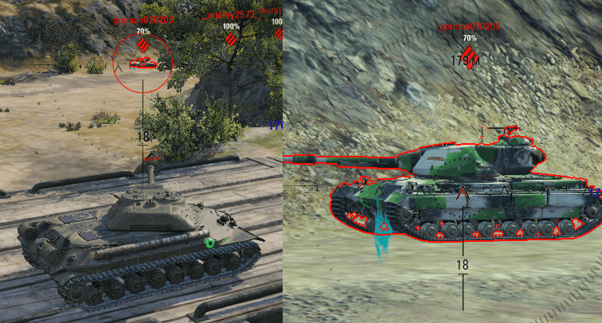
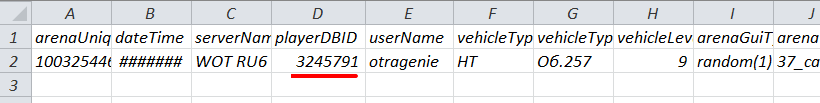
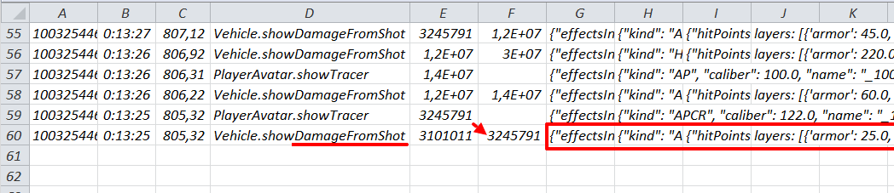
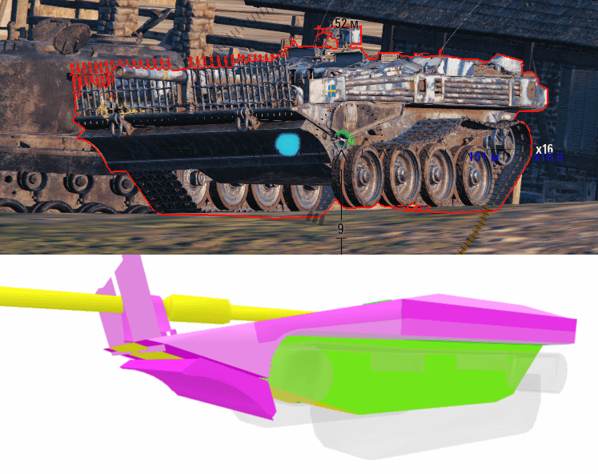
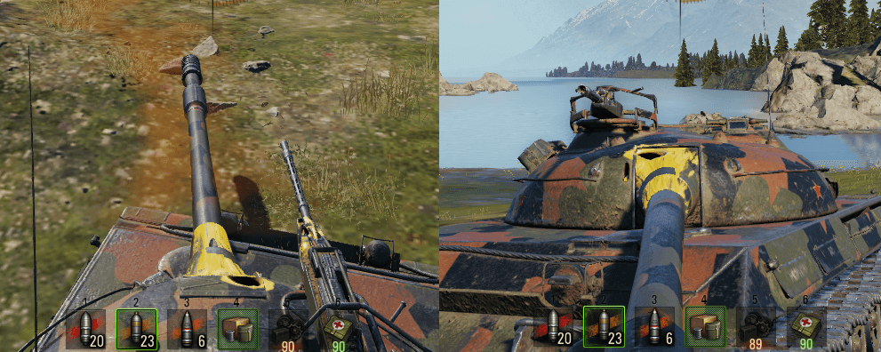
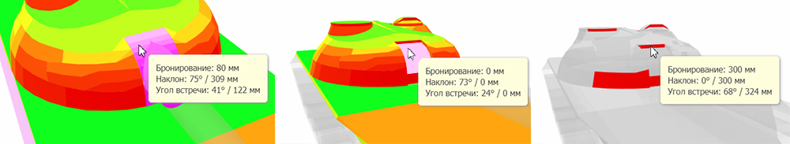

# Анализ попаданий
Ниже рассказывается, как с использованием мода можно разбирать и изучать результаты попаданий, пробитий, непробитий и рикошетов. Для визуализации бронирования техники в примерах демонстрируются скриншоты с сайта https://gamemodels3d.com/.

## Введение
### Получение данных из реплея игры
Устанавливаем мод в клиент игры, для чего качаем zip-архив и извлекаем его содержимое в папку с игрой. После этого запускаем реплей и просматриваем его **без перемотки и большого ускорения** до конца или до интересующего вас события, например попадания или выстрела. После того как событие произойдет ставим реплей на паузу. Далее идём в папку "World_of_Tanks\mods\logs\".

### Лог файлы
Мод записывает информацию в файлы **"sl_battles_xxx.csv"**, **"sl_events_xxx.csv"** и **"sl_players_xxx.csv"**, которые открываются через MS Office Excel или в любом другом офисе. Назначение файлов следующее:
* **"sl_battles_xxx.csv"** - содержит данные о карте, типе боя, игроке
* **"sl_players_xxx.csv"** - содержит информацию о союзниках и противниках, их рейтингах и статистике
* **"sl_events_xxx.csv"** - содержит данные о событиях, происходящих в бою

Наиболее важным параметров в этих файлах является идентификатор игрока. В файле **"sl_battles_xxx.csv"** это **playerDBID** игрока от чего имени записан реплей. Зная ID-игрока вы можете найти все события связанные с этим игроком в файле **"sl_events_xxx.csv"**. Если же нас интересует не главный игрок, а кто-то из союзников или противников, то, открыв файл **"sl_players_xxx.csv"**, вы легко найдете нужного вам игрока и сможете узнать его **playerDBID**.

### События в бою
Мод отслеживает разные события в бою и сопутствующие им данные записывает в файл **"sl_events_xxx.csv"**. Следующие события относятся к стрельбе:
* **PlayerAvatar.showTracer** - отрисовка трассера после выстрела
* **Vehicle.showDamageFromShot** - прямое попадание снаряда в модель танка
* **Vehicle.showDamageFromExplosion** - поражение модели танка сплэшем разорвавшегося рядом ОФ-снаряда

Каждое из событий записывается в файл, занимания в нём одну строчку в хронологическом порядке появления этих событий в бою. Ниже показан пример таких строк:


Информация разбита на столбцы: **arenaUniqueID** - это идентификатор боя; **timeLeft** - время до конца боя согласно таймеру; **timeLeftSec** - тоже самое только в секундах; **event** - событие; **userDBID** - ID-игрока, с которым произошло событие; **attakerDBID** - ID-игрока, ставшего причиной события (зависит от вида события); наконец **initialInfo**, **shellInfo** и **decodeInfo** - игровая и техническая информация о событии в виде значений переменных, параметров и декодированной информации.

В примере первым сделал выстрел игрок _18702498_ (**строка 2**), однако его снаряд ни в кого не попал. Вторым стрелял игрок _30001006_ (**строка 3**). Его снаряд попал в игрока _29380785_, об этом говорит запись в **строке 4**, видим событие **Vehicle.showDamageFromShot**, причиной которого стал **attakerDBID:** _30001006_. Попадание произошло в _14:31_ с момента начала боя.

### Информация о попаданиях
Данные о попадании группируются в три столбца, разберём их:
* **initialInfo** - необработанные значения внутренних переменных и данных с сервера
* **shellInfo** - декодированная и сгруппированная информация о снаряде
* **decodeInfo** - декодированные и обработанные данные о результатах события

Информация может выводиться и в других столбцах, не имеющих заголовков, например, список слоёв или групп брони, которые расположены на траектории движения снаряда. Так как именно эти декодированные модом данные в нашем случае и представляют наибольший интересен, разберем их подробнее.

**Информация о снаряде:**
```
{"kind": "AP",                  //Тип снаряда:
                                  AP-бронебойный,
                                  APRC-подкалиберный, 
                                  HC-кумулятивный, 
                                  HE-фугасный
 "caliber": 122.0,              //Калибр орудия в мм
 "name": "_122mm_UBR-471",      //Марка снаряда
 "gravity": 9.810000711977496,  //Ускорение свободного падения, м/с^2
 "piercingPower": "(175, 152)", //Среднее пробитие в мм на дистанциях 100 м и 500 м
 "damage": "(390.0, 165.0)",    //Средний урон по танку и по модулям
 "maxDistance": 720.0,          //Максимальная дальность полёта снаряда в м
 "speed": 780.0000116229057     //Начальная скорость полёта снаряда в м/с
}
```

**Итоговые результаты попадания:**
```
{"distance": 277.21856689453125,                    //Дистанция между опорными точками моделей танков в м
 "hasPiercedHit": true,                             //Снаряд пробил основную броню или модуль
 "maxDamagedComponent": "hull",                     //Часть модели, которой нанесён наибольший ущерб:
                                                      "hull"-корпус
                                                      "turret"-башня
                                                      "chassis"-ходовая
                                                      "gun"-пушка с маской
 "hitPoints": [                                     //Точки обсчёта, присланные сервером и дешифрованные клиентом
               {"componentName": "chassis",         //Часть модели, которой принадлежит первая точка
                "hitEffectGroup": "armorResisted"}, //Эффект в первой точке:
                                                      armorBasicRicochet-промежуточный рикошет
                                                      armorRicochet-финальный рикошет
                                                      armorResisted-слой не пробит или пробит без урона
                                                      armorHit-слой пробит с уроном
                                                      armorCriticalHit-слой пробит с критом модуля
               {"componentName": "hull",            //Часть модели, которой принадлежит вторая точка
                "hitEffectGroup": "armorHit"}],     //Эффект во второй точке
 "maxHitEffectCode": "ARMOR_PIERCED"                //Итоговый эффект от попадания:
                                                      INTERMEDIATE_RICOCHET-промежуточный рикошет
                                                      FINAL_RICOCHET-финальный рикошет
                                                      ARMOR_NOT_PIERCED-попадание без пробития
                                                      ARMOR_PIERCED_NO_DAMAGE-попадание с пробитием без урона
                                                      ARMOR_PIERCED-попадание с пробитием и уроном
                                                      CRITICAL_HIT-попадание с скритом модуля
}
```

Так как сервер не предоставляет подробной информации о том какой толщины броню и под каким углом снаряд преодолел и сколько на его пути оказалось (или могло оказаться) слоёв брони, то мод самостоятельно выполняет **collide** в точке первого падания снаряда и выводит информацию обо всех слоях на глубину до 5 м. При этом игнорируются:
* "исторические" слои
* нестандартные части модели
* слои, идущие после заброневого пространства модели

**Слои:**
```
layers: [{'armor': 20.0,                   //Толщина 1-слоя брони по нормали в мм
          'distanse': 0.0,
          'angleCos': 0.13699644804000854, //Косинус угла вхождения снаряда к нормали
          'tankPart': 'chassis'            //Часть модели, которой принадлежит слой брони (входное пробитие ходовой)
         },
         {'armor': 20.0,                   //Толщина 2-слоя брони по нормали в мм
          'distanse': 0.25760190784931183,
          'angleCos': 0.14728343422222223,
          'tankPart': 'chassis'            //Выходное пробитие ходовой
         },
         {'armor': 52.0,                   //Толщина 3-слоя брони по нормали в мм 
          'distanse': 0.47879877789282388,
          'angleCos': 0.7032369375228882,
          'tankPart': 'hull'               //Входное пробитие корпуса
         }]
```

Следует обратить внимание, что информация о слоях **"layers"** это справочная информация и она может не совпадать или разница с данными об итогах попадания, так как последние приходят с сервера, а collide слоёв в точке попадания делается модом на клиенте игры. В результате могут возникать расхождения по месту и времени. По этой причине проигрывать интересующее вас событие в реплее следует на **малой скорости**, а не быстро, чтобы избежать дополнительных ошибок и расхождений в расчётах со стороны мода.

## Пример попадания без урона
Рассмотрим ситуацию, когда выстрел был сделан с попаданием в противника, но без урона, при этом не видно как и куда конкретно попал снаряд. На картинке выстрел Об.257 по S.Conqueror сходу при движении по мосту без урона. Так как наш игрок стрелял в движении, то между направлением прицела игрока и видимым голубым трассером имеется угол расхождения, который и затрудняет анализ ситуации.



Запускаем реплей, доходим до выстрела, ставим на паузу и смотрим записи в **"sl_battles_xxx.csv"** и **"sl_events_xxx.csv"**:





Берём данные о выстреле из последних двух колонок:

```
{"distance": 181.22067260742188, "hasPiercedHit": false, "maxDamagedComponent": "chassis",
 "hitPoints": [{"componentName": "chassis", "hitEffectGroup": "armorResisted"}], "maxHitEffectCode": "ARMOR_PIERCED_NO_DAMAGE"}

layers: [{'armor': 25.0, 'distanse': 0.0, 'angleCos': 0.8137211203575134, 'tankPart': 'chassis'},
         {'armor': 25.0, 'distanse': 0.9654179438948631, 'angleCos': 0.09530030936002731, 'tankPart': 'chassis'}]
```

Из первой строки следует, что урон противнику нанесён не был (**false**). Сервер прислал только одну точку, в этой точке произошло попадание в гусеницу (**"chassis"**) без её крита (**"armorResisted"**). Что стало со снарядом после этого, сказать нельзя, сервер не счёл нужным прислать подробную информацию. Поэтому смотрим на список **layers**, он позволяет нам выяснить какие слои встретил или мог встретить на своём пути снаряд после первого попадания. Видим два слоя ходовой (**"chassis"**), очевидно, что первый - это слой входного пробития, а второй слой - это слой выходного пробития. Следовательно траектория снаряда действительно проходила мимо корпуса танка и, пробив гусеницу, он ушел в землю.

## Пример сбития гусеницы с уроном по танку
Еще одна ситуация, связанная с ходовой танка, это пробитие основной брони через ведущий каток с уроном по танку. На картинке Kranvagn поставил на гусеницу Strv 103B, когда та отъезжала назад с поворотом. Так как действия происходят в динамике, то мы видим рассхождение между траекторией полета голубого снаряда и зеленым маркером в точке попадания. Напомню, что на близких дистанциях маркер попадания часто появляется еще до того как снаряд долетел до цели.



Рассмотрим результаты попадания из файла **"sl_events_xxx.csv"**:

```
{"kind": "APCR", "caliber": 120.0, "name": "_120mm_slpprj_m_51", "gravity": 9.810000711977496, "piercingPower": "(252, 228)", "damage": "(440.0, 165.0)", "maxDistance": 720.0, "speed": 1000.0000149011612}

{"distance": 151.37313842773438, "hasPiercedHit": true, "maxDamagedComponent": "hull", 
 "hitPoints": [{"componentName": "hull", "hitEffectGroup": "armorCriticalHit"}], "maxHitEffectCode": "CRITICAL_HIT"}

layers: [{'armor': 20.0, 'distanse': 0.0, 'angleCos': 0.48855721950531006, 'tankPart': 'hull'},
         {'armor': 20.0, 'distanse': 0.26653267443180084, 'angleCos': 0.772782027721405, 'tankPart': 'hull'},
         {'armor': 20.0, 'distanse': 0.5497215837240219, 'angleCos': 0.8542053699493408, 'tankPart': 'chassis'}, 
         {'armor': 20.0, 'distanse': 0.9218020886182785, 'angleCos': 0.03188077732920647, 'tankPart': 'chassis'}, 
         {'armor': 30.0, 'distanse': 1.4062887877225876, 'angleCos': 0.48844999074935913, 'tankPart': 'hull'}]
```

Из третьей строки следует, что попадание было нанесено с дистанции около 151 м (**"distance"**), была пробита (**true**) броня корпуса (**"hull"**) и нанесен критический урон модулю (**"CRITICAL_HIT"**). Из строк **layers** следует, как это могло происходить на сервере игры. Снаряд встретил на своём пути несколько слоёв:
* сначала попал в корус (**'hull'**)
* затем вышел из него (**'hull'**)
* после этого попал в ходовую (**'chassis'**)
* пробил её насвозь (**'chassis'**)
* и после этого опять попал в корпус (**'hull'**)

Если смотреть на коллижен пробития, то получается, что первые два слоя корпуса это был экран, которым прикрыта передняя часть танка. Попав в край экрана, снаряд его пробил насквозь, затем прошел через каток, сняв гусеницу с танка, и после этого попал в борт корпуса, который и пробил. Однако сервер прислал только одну точку пробития (**"hitPoints"**). Да и зеленый маркер нарисован так, что не понятно, задет экран коллижена пробития или нет. Отсюда можно сделать два вывода:
1. Маркер попадания, как и трассер, не указывают точно, куда в реальности и как попал снаряд, т.к. он рисуется клиентом после декодирования информации, присланной сервером и делается это через collide модели
2. Сервер присылает не всю информацию клиенту игры, а только ту, которую счёл нужным или достаточным прислать, а может и не прислать её вовсе

## Пример пробитие HESH-снарядом маски
В этом примере рассматривается попадание в танк Об.430У от FV4005 фугасным HESH-снарядом. Попадание пришлось в маску орудия и привело к урону на 774 хп.



```
{"kind": "HE", "caliber": 182.89999389648438, "name": "_183mm_HESH", "gravity": 9.810000711977496, "piercingPower": "(230, 230)", "damage": "(1750.0, 244.0)", "maxDistance": 720.0, "explosionRadius": 5.050000190734863, "speed": 830.0000123679638}

{"distance": 302.7235107421875, "hasPiercedHit": true, "maxDamagedComponent": "turret", 
 "hitPoints": [{"componentName": "gun", "hitEffectGroup": "armorResisted"}, 
               {"componentName": "gun", "hitEffectGroup": "armorResisted"}, 
               {"componentName": "turret", "hitEffectGroup": "armorHit"}], "maxHitEffectCode": "ARMOR_PIERCED"}

layers: [{'armor': 80.0, 'distanse': 0.0, 'angleCos': 0.3301214277744293, 'tankPart': 'gun'},
         {'armor': 0.0, 'distanse': 0.15319880098104477, 'angleCos': 0.35898542404174805, 'tankPart': 'gun'},
         {'armor': 300.0, 'distanse': 0.159470833837986, 'angleCos': 0.9999175071716309, 'tankPart': 'turret'}]
```

Из списка **hitPoints** выше следует, что сервер анализировал попадание трижды, при этом результатом стало пробитие башни (**"turret"**) с уроном по танку (**"ARMOR_PIERCED"**). По данным мода на пути снаряда оказалось три слоя, все три я нашел на коллижене пробития, сверясь со списком **layers**. Первые два это внешний и внутренний слои маски пушки, а третий это торец выреза башни.



Однако следует помнить, что речь идёт об ОФ-снаряде, следовательно, пробитым непосредственно снарядом был только первый слой, это 80 мм экран маски, а далее урон по танку определялся сервером, исходя из принципа поиска наименьшей брони, а не траектории полёта снаряда. Зная это, можно с уверенностью предположить, что осколки снаряда, образовавшиеся после пробития первого слоя маски, проникли в башню через самые тонкие слои. Такими слоями являются внутренний слой маски пушки и слой-мембрана башни, закрывающая вырез в ней, оба они имеют нулевое бронирование. Вот через них осколки и проникли в заброневое пространство.