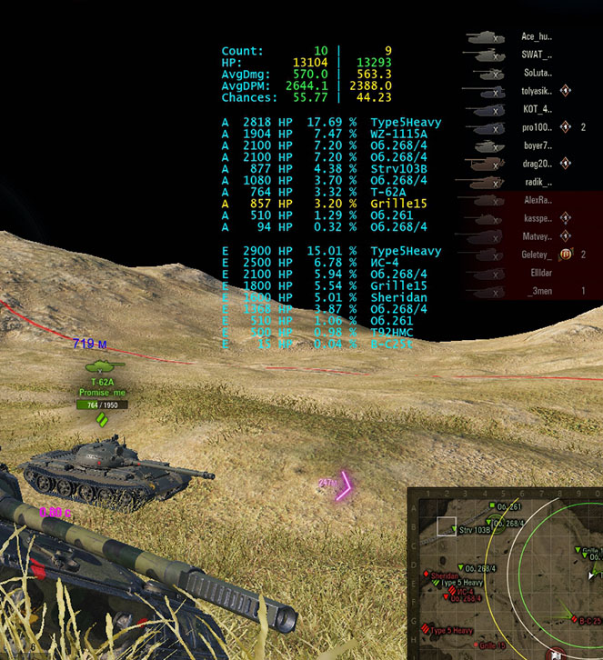

# VictoryChancesGUI

### Description
GUI-mod for displaying in a battle the chances of winning (using the **NSM**)

## History
With the history of versions can be found [here][]

## Install
1. Download the "[net.statistics.modules_X.X.X.wotmod][]" to the folder "World_of_Tanks\mods\X.X.X\"
2. Extract all files from "[VictoryChancesGUI.zip][]" to the folder "World_of_Tanks\mods\X.X.X\"

If there is no package "gambiter.guiflash_xxx.wotmod" in the zip-archive, then download its actual version from the [repository](https://github.com/GambitER/GUIFlash/releases).

### Screenshots

[here]:./HISTORY.md
[net.statistics.modules_X.X.X.wotmod]:../NetStatisticsModules/zip
[VictoryChancesGUI.zip]:./zip